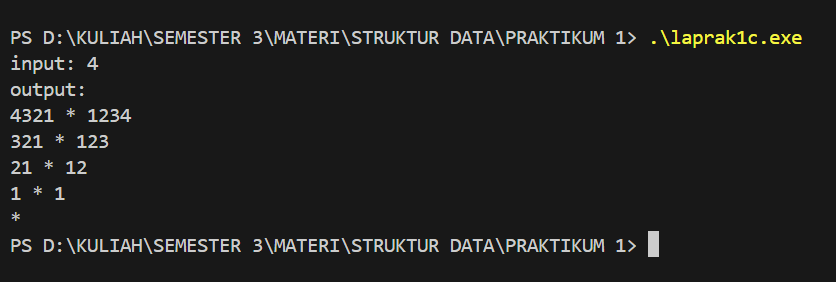

# Laporan Praktikum Struktur Data

## 1. Nama, NIM, Kelas
- **Nama**: Galang Aswangga Saputra
- **NIM**: 103112430053
- **Kelas**: 12-IF-05

## 2. Motivasi Belajar Struktur Data
tentunya selain karena agar lulus matkul ini agar bisa mengambil matkul selanjutnya, belajar struktur data itu penting karena di dalamnya mempelajari bahasa pemrograman c++ yang dimana bahsa ini mau ga mau anak if harus paham, karena banyak liat di dunia sosmed, orang orang tuh bisa menggunkan bahasa ini, jadi ya iri aja gitu, mana semester sebelumnya cuman bahas go
## 3. Dasar Teori
stuktur data itu ibaratnya buat mengatur dan menyipan supaya bisa di cari, diproses, dan juga di ubah . Nah dari pemilihann stuktur data yang bagus dapat membuat program nya bisa berjalan lebih bagus , lebih efisien dll

- **Array** Array adalah struktur data linear yang menyimpan elemen dengan tipe data yang sama dalam blok memori yang berdekatan. Elemen dalam array diakses menggunakan indeks numerik.
- **Linked List** Linked List adalah struktur data linear di mana setiap elemen (disebut node) berisi data dan pointer yang menunjuk ke node berikutnya. Tidak seperti array, linked list tidak menyimpan elemen secara berurutan di memori.
- **Stack**  
    Stack (tumpukan) adalah struktur data linear yang menerapkan prinsip **Last In, First Out (LIFO)**. Elemen terakhir yang ditambahkan akan menjadi yang pertama diambil.
- **Queue**  
    Queue (antrian) adalah struktur data linear yang menerapkan prinsip **First In, First Out (FIFO)**. Elemen pertama yang masuk akan menjadi yang pertama keluar.
- **Tree**  
    Tidak seperti array, linked list, stack dan queue, yang merupakan struktur data linier, tree adalah struktur data hierarkis. Binary tree adalah jenis struktur tree di mana setiap node memiliki paling banyak dua child, yang disebut sebagai left child dan right child. Binary tree seringkali diimplementasikan menggunakan link.
- **Graph**  
    Graph adalah struktur data yang terdiri dari kumpulan simpul berhingga untuk menyimpan data dan antara dua buah simpul terdapat hubungan saling keterkaitan. Graph merepresentasikan kumpulan object dimana pasangan dari objek terhubung oleh sebuah link.

## 4. Guided
### 4.1 Discount

```cpp
#include <iostream>

  

using namespace std;

int main(){

    double total_pembelian,diskon;

    cout << "Berapa kamu belanja : Rp. ";

    cin >> total_pembelian;

    if (total_pembelian >= 30000){

        diskon = 0.1 * total_pembelian;

        cout << "Kamu dapat diskon sebesar " << diskon << " orang kaya lu tong ";

    } else {

        cout << "kamu belanjanya masih dikit, Tambahin lah, biar gua kaya";

    }

    return 0;

}
```

output


Penjelasan :
Program ini ngecek total belanja. Kalau lebih dari atau sama dengan 30 ribu, nanti mendaptkan potongan 10% . Tapi kalau belanjanya kurang dari itu, program bilang kita nggak dapet diskon karena “langka modal”.
### 4.2 perulangan

```cpp
#include <iostream>

  

using namespace std;

  

int main(){

    int jumlah;

    cout << "Tulis berapa banyak perulangannya : ";

    cin >> jumlah;

    for (int i = 0; i<jumlah; i++){

        cout <<"Saya sangat pintar seperti albert einstein" << endl;

    }

    return 0;

}
```

output


penjelasan: 
 Program ini buat mengulang sebuah output. Pertama program bertanya dulu, “Tulis berapa banyak Perulangan?”. Nah, angka yang masukin itu bakal jadi patokan berapa kali kalimat dicetak. Misalnya kamu masukin 3 , maka program akan mengulang sebanyak 3 kali

### 4.3 Suhu

```cpp
#include <iostream>

  

using namespace std;

  

int main(){

    float celcius,fahrenheit;

    cout << "Tulis sedingin apa gebetan lu : ";

    cin >> celcius;

    fahrenheit = (9.0/5.0)* celcius + 32;

    cout << "Kalau di fahreheit itu " << fahrenheit << "derajat" <<endl;

    cout << "itu dingin banget sih, saran gua jauhin aja";

    return 0;

}
```

output


penjelasan:
Program ini buat ngubah suhu dari Celcius ke Fahrenheit. User di minta untuk menginputkan suhu dalam Celcius, lalu program menghitung menggunakan rumus (9/5)×celcius+32. Hasilnya ditampilin dalam Fahrenheit dan sedikit pesan
### G 

## 5. Unguided
### 5.1 Unguided 1
``` cpp
#include <iostream>

using namespace std;

  

int main() {

    float a, b;

    cout << "Masukkan bilangan pertama: ";

    cin >> a;

    cout << "Masukkan bilangan kedua: ";

    cin >> b;

  

    cout << "Penjumlahan: " << a + b << endl;

    cout << "Pengurangan: " << a - b << endl;

    cout << "Perkalian  : " << a * b << endl;

    if (b != 0)

        cout << "Pembagian  : " << a / b << endl;

    else

        cout << "Pembagian  : Tidak bisa dibagi 0" << endl;

  

    return 0;

}
```

output

penjelasan:
Program ini meminta dua bilangan dari pengguna, lalu menampilkan hasil operasi aritmetika dasar (tambah, kurang, kali, dan bagi). Jika bilangan kedua bernilai 0, pembagian tidak dilakukan.

### 5.2 Unguided 2
```cpp
#include <iostream>

using namespace std;

  

string satuan[] = {"nol","satu","dua","tiga","empat","lima","enam","tujuh","delapan","sembilan",

                   "sepuluh","sebelas","dua belas","tiga belas","empat belas","lima belas",

                   "enam belas","tujuh belas","delapan belas","sembilan belas"};

  

string puluhan[] = {"","", "dua puluh","tiga puluh","empat puluh","lima puluh","enam puluh",

                    "tujuh puluh","delapan puluh","sembilan puluh"};

  

string terjemah(int n) {

    if (n < 20) return satuan[n];

    else if (n < 100) {

        int p = n / 10;

        int s = n % 10;

        if (s == 0) return puluhan[p];

        else return puluhan[p] + " " + satuan[s];

    } else if (n == 100) return "seratus";

    else return "di luar jangkauan";

}

  

int main() {

    int n;

    cout << "Masukkan angka (0-100): ";

    cin >> n;

    cout << n << " : " << terjemah(n) << endl;

    return 0;

}
```

output


penjelasan:
Program ini menerjemahkan angka 0–100 ke dalam bentuk teks bahasa Indonesia (misalnya 25 “dua puluh lima”). Jika angka di luar rentang 0–100, akan ditampilkan pesan “di luar jangkauan”.

### 5.3 Unguided 3
```cpp
#include <iostream>

using namespace std;

  

int main() {

    int n;

    cout << "input: ";

    cin >> n;

    cout << "output:" << endl;

  

    for (int i = n; i >= 1; i--) {

        // kiri

        for (int j = i; j >= 1; j--)

            cout << j;

        cout << " * ";

        // kanan

        for (int j = 1; j <= i; j++)

            cout << j;

        cout << endl;

    }

    cout << "*" << endl;

    return 0;

}
```

output


penjelasan:
Kesimpulan singkat:  
Program ini mencetak pola angka simetris menurun dari input n, dengan bagian kiri berisi angka menurun, bagian kanan angka menaik, dan dipisahkan tanda *. Setelah baris terakhir, program mencetak tanda * sendiri.
## 6. Kesimpulan
jadi setelah saya mempelajari sedikir dari bahasa c++, bahasa ini ternyata tidak seseram yang di bayangkan
## 7. Referensi
1. [https://dte.telkomuniversity.ac.id/struktur-data-dasar-array-linked-list-stack-dan-queue/](https://dte.telkomuniversity.ac.id/struktur-data-dasar-array-linked-list-stack-dan-queue/)
2. [https://www.trivusi.web.id/2022/06/mengenal-struktur-data.html](https://www.trivusi.web.id/2022/06/mengenal-struktur-data.html)