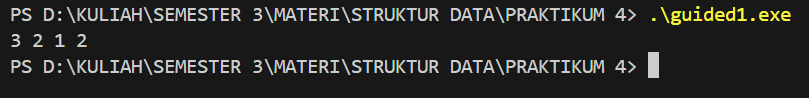
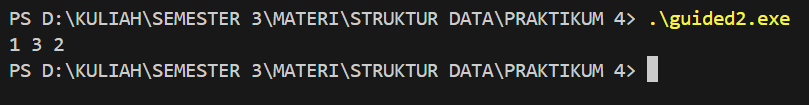
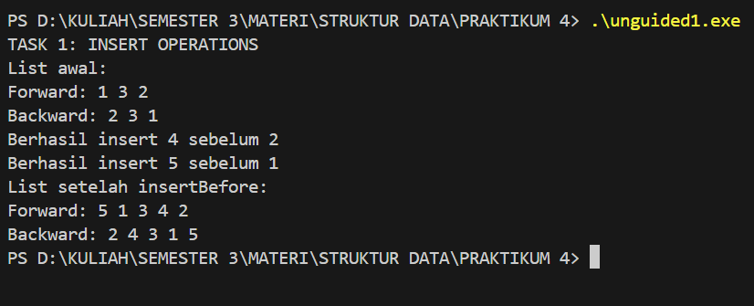
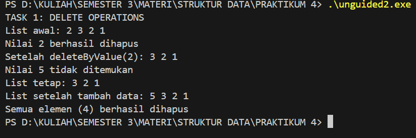
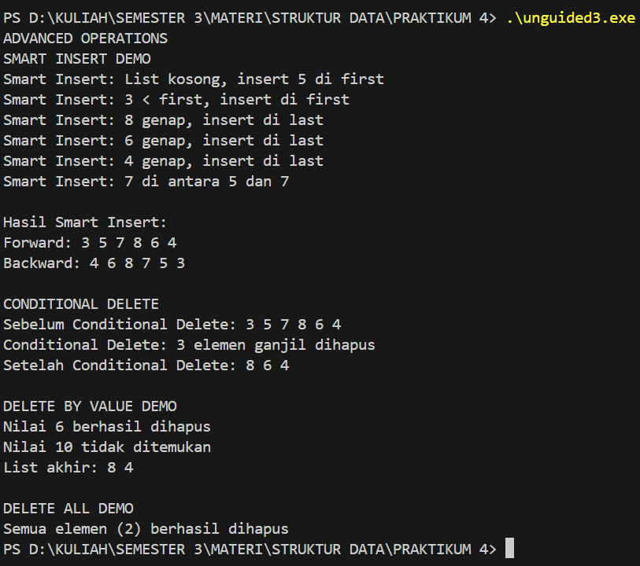

# Laporan Praktikum Struktur Data

## 1. Nama, NIM, Kelas
- **Nama**: Galang Aswangga Saputra
- **NIM**: 103112430053
- **Kelas**: 12-IF-05

## 2. Motivasi Belajar Struktur Data
tentunya selain karena agar lulus matkul ini agar bisa mengambil matkul selanjutnya, belajar struktur data itu penting karena di dalamnya mempelajari bahasa pemrograman c++ yang dimana bahsa ini mau ga mau anak if harus paham, karena banyak liat di dunia sosmed, orang orang tuh bisa menggunkan bahasa ini, jadi ya iri aja gitu, mana semester sebelumnya cuman bahas go
## 3. Dasar Teori
Struktur data adalah cara untuk menyimpan dan mengorganisir data dalam komputer agar dapat digunakan secara efisien. Berikut adalah teori dasar mengenai Array, Pointer, dan Fungsi:

-Array adalah salah satu struktur data paling dasar dan esensial dalam pemrograman. Secara sederhana, array adalah sekumpulan elemen yang disusun secara berurutan dan memiliki tipe data yang sama. Setiap elemen dalam array dapat diakses menggunakan indeks, yang biasanya dimulai dari nol. Penggunaan array memungkinkan penyimpanan dan manipulasi sejumlah besar data dengan cara yang efisien dan terstruktur. (Rumahcoding.co.id)
-Setiap variabel yang kita deklarasikan di program memiliki alamat memori di RAM. Alamat ini digunakan oleh komputer untuk menyimpan dan mengakses data. Nah, pointer adalah variabel khusus yang berisi alamat memori variabel lain.(codepolitan.com)
**Fungsi dan Parameter Referensi** Fungsi dalam C++ digunakan untuk memecah program menjadi bagian-bagian kecil yang dapat digunakan kembali. Salah satu konsep pentingnya adalah _pass by reference_, yaitu ketika variabel dikirim ke fungsi bukan sebagai salinan, tetapi sebagai referensi ke variabel asli. Dengan begitu, perubahan di dalam fungsi langsung mempengaruhi data aslinya. _“Penggunaan parameter referensi dalam fungsi memungkinkan efisiensi pemrosesan data dan mendukung prinsip modularitas dalam pemrograman”_
## 4. Guided
### 4.1 Guided 1


```cpp
#include <iostream>
using namespace std;
#define Nil NULL

typedef int infotype;
typedef struct elmlist *address;

struct elmlist {
    infotype info;
    address next;
    address prev;
};

struct List {
    address first;
    address last;
};

address alokasi(infotype x) {
    address P = new elmlist;
    P->info = x ; P->next = Nil; P->prev = Nil; return P;
}
void dealokasi(address &P) {delete P; P = Nil;}
void insertFirst(List &L, address P) {
    P->next = L.first; P->prev = Nil;
    if (L.first != Nil) L.first->prev = P; else L.last = P;
    L.first = P;
}

void printInfo(List L) {
    address P = L.first; while (P != Nil) {cout << P->info << " "; P = P-> next;} cout;
}
void deleteFirst(List &L, address &P) {
    P = L.first; L.first = L.first->next;
    if (L.first != Nil) L.first->prev = Nil; else L.last = Nil;
    P->next = Nil; P->prev = Nil;
}

void deleteLast (List &L, address &P) {
    P = L.last; L.last = L.last->prev;
    if (L.last != Nil) L.last->next = Nil; else L.first = Nil;
    P->prev = Nil; P->next = Nil;
}

void deleteAfter (List &L, address &P, address R) {
    P = R->next; R->next = P->next;
    if (P->next != Nil) P->next->prev = R; else L.last = R;
    P->prev = Nil; P->next = Nil;
}

int main() {
    List L; L.first = Nil; L.last = Nil;
    insertFirst(L, alokasi (1)); insertFirst(L, alokasi(2)); insertFirst (L, alokasi(3));
    printInfo(L);
    address P; deleteFirst(L, P); dealokasi (P);
    deleteAfter (L, P, L.first); dealokasi (P);
    printInfo(L);
    return 0;
}
```

output

penjelasan:
elmlist menyimpan data dan dua pointer (next dan prev), sedangkan List menyimpan first dan last. Fungsi alokasi() membuat node baru, dealokasi() menghapus node, insertFirst() menambah di awal, dan printInfo() menampilkan seluruh isi list. Fungsi deleteFirst(), deleteLast(), dan deleteAfter() menghapus elemen sesuai posisinya. Di main(), node 1, 2, 3 ditambahkan di awal sehingga urutan akhir menjadi 3 → 2 → 1, lalu beberapa elemen dihapus dan sisa list ditampilkan. Program ini menunjukkan dasar operasi double linked list dengan traversal maju dan mundur.

## Guided 2

```cpp
#include <iostream>
#define Nil NULL
using namespace std;

typedef int infotype;
typedef struct elmlist *address;

struct elmlist{
    infotype info;
    address next;
    address prev;
};

struct List {
    address first;
    address last;
};

void insertFirst(List &L, address P) {
    P->next = L.first;
    P->prev = Nil;
    if (L.first != Nil) L.first->prev = P;
    else L.last = P ;
    L.first = P;
}

void insertLast(List &L, address P) {
    P->prev = L.last;
    P->next = Nil;
    if (L.last != Nil) L.last -> next = P;
    else L.first = P;
    L.last = P;
}

void insertAfter (List &L, address P, address R) {
    P->next = R->next;
    P->prev = R;
    if (R->next != Nil) R->next->prev = P;
    else L.last = P;
    R->next = P;
}


address alokasi(infotype x) {
    address P = new elmlist;
    P->info = x;
    P->next = Nil;
    P->prev = Nil;
    return P;
}

void printInfo(List L) {
    address P = L.first;
    while (P != Nil) {
        cout << P->info << " ";
        P = P-> next ;
    }
    cout << endl;
}

int main(){
    List L;
    L.first = Nil;
    L.last = Nil;
    address P1 = alokasi(1);
    insertFirst(L, P1);
    address P2 = alokasi(2);
    insertLast(L, P2);
    address P3 = alokasi(3);
    insertAfter(L, P3, P1);
    printInfo(L);
    return 0;
}

```

Output

Penjelasan
elmlist adalah node yang menyimpan data dan dua pointer (next dan prev), sedangkan List menyimpan first dan last. Fungsi alokasi() membuat node baru, insertFirst() menambah di awal, insertLast() di akhir, dan insertAfter() setelah node tertentu. Di main(), list dibuat kosong, lalu node 1, 2, 3 ditambahkan sehingga urutan akhir menjadi 1, 3, 2, kemudian ditampilkan dengan printInfo().


# 5. Unguided
## Unguided 1

```cpp
#include <iostream>

#define Nil NULL

using namespace std;

typedef int infotype;
typedef struct elmlist *address;

struct elmlist {
    infotype info;
    address next;
    address prev;
};

struct List {
    address first;
    address last;
};

void insertFirst(List &L, address P) {
    P->next = L.first;
    P->prev = Nil;
    if (L.first != Nil) L.first->prev = P;
    else L.last = P;
    L.first = P;
}

void insertLast(List &L, address P) {
    P->prev = L.last;
    P->next = Nil;
    if (L.last != Nil) L.last->next = P;
    else L.first = P;
    L.last = P;
}

void insertAfter(List &L, address P, address R) {
    P->next = R->next;
    P->prev = R;
    if (R->next != Nil) R->next->prev = P;
    else L.last = P;
    R->next = P;
}

address alokasi(infotype x) {
    address P = new elmlist;
    P->info = x;
    P->next = Nil;
    P->prev = Nil;
    return P;
}

void printInfo(List L) {
    address P = L.first;
    while (P != Nil) {
        cout << P->info << " ";
        P = P->next;
    }
    cout << endl;
}

void insertBefore(List &L, address P, address R) {
    P->next = R;
    P->prev = R->prev;
    if (R->prev != Nil)
        R->prev->next = P;
    else
        L.first = P;
    R->prev = P;
}

void printReverse(List L) {
    address P = L.last;
    while (P != Nil) {
        cout << P->info << " ";
        P = P->prev;
    }
    cout << endl;
}

int main() {
    List L;
    L.first = Nil;
    L.last = Nil;

    cout << "TASK 1: INSERT OPERATIONS" << endl;

    // Membuat list awal: 1 3 2
    address P1 = alokasi(1);
    insertFirst(L, P1);
    address P2 = alokasi(2);
    insertLast(L, P2);
    address P3 = alokasi(3);
    insertAfter(L, P3, P1);

    cout << "List awal:" << endl;
    cout << "Forward: ";
    printInfo(L);
    cout << "Backward: ";
    printReverse(L);

    // InsertBefore: 4 sebelum 2
    address P4 = alokasi(4);
    insertBefore(L, P4, P2);
    cout << "Berhasil insert 4 sebelum 2" << endl;

    // InsertBefore: 5 sebelum 1
    address P5 = alokasi(5);
    insertBefore(L, P5, P1);
    cout << "Berhasil insert 5 sebelum 1" << endl;

    cout << "List setelah insertBefore:" << endl;
    cout << "Forward: ";
    printInfo(L);
    cout << "Backward: ";
    printReverse(L);

    return 0;
}
```

Output

Penjelasan
Program ini mendemonstrasikan double linked list, di mana elmlist menyimpan data dan dua pointer antar elemen, sedangkan List menampung pointer ke first dan last. Operasi yang digunakan meliputi insertFirst, insertLast, insertAfter, dan insertBefore. Di main(), list dibentuk dengan urutan awal 1, 3, 2, kemudian disisipkan 4 sebelum 2 dan 5 sebelum 1, sehingga urutan akhir menjadi 5, 1, 3, 4, 2. Isi list ditampilkan dari depan dan belakang untuk memastikan setiap node terhubung dengan benar.
## Unguided 2

```cpp
#include <iostream>

using namespace std;

#define Nil NULL

  

typedef int infotype;

typedef struct elmlist *address;

  

struct elmlist {

    infotype info;

    address next;

    address prev;

};

  

struct List {

    address first;

    address last;

};

  

address alokasi(infotype x) {

    address P = new elmlist;

    P->info = x;

    P->next = Nil;

    P->prev = Nil;

    return P;

}

  

void dealokasi(address &P) {

    delete P;

    P = Nil;

}

  

void insertFirst(List &L, address P) {

    P->next = L.first;

    P->prev = Nil;

    if (L.first != Nil)

        L.first->prev = P;

    else

        L.last = P;

    L.first = P;

}

  

void printInfo(List L) {

    address P = L.first;

    while (P != Nil) {

        cout << P->info << " ";

        P = P->next;

    }

    cout << endl;

}

  

void deleteFirst(List &L, address &P) {

    P = L.first; L.first = L.first->next;

    if (L.first != Nil) L.first->prev = Nil; else L.last = Nil;

    P->next = Nil; P->prev = Nil;

}

  

void deleteLast (List &L, address &P) {

    P = L.last; L.last = L.last->prev;

    if (L.last != Nil) L.last->next = Nil; else L.first = Nil;

    P->prev = Nil; P->next = Nil;

}

  

void deleteAfter (List &L, address &P, address R) {

    P = R->next; R->next = P->next;

    if (P->next != Nil) P->next->prev = R; else L.last = R;

    P->prev = Nil; P->next = Nil;

}

  

bool deleteByValue(List &L, infotype x) {

    address P = L.first;

  

    while (P != Nil && P->info != x) {

        P = P->next;

    }

  

    if (P == Nil) {

        cout << "Nilai " << x << " tidak ditemukan" << endl;

        return false;

    }

  

    if (P == L.first) {

        L.first = P->next;

        if (L.first != Nil)

            L.first->prev = Nil;

        else

            L.last = Nil;

    } else if (P == L.last) {

        L.last = P->prev;

        if (L.last != Nil)

            L.last->next = Nil;

        else

            L.first = Nil;

    } else {

        P->prev->next = P->next;

        P->next->prev = P->prev;

    }

  

    cout << "Nilai " << x << " berhasil dihapus" << endl;

    dealokasi(P);

    return true;

}

  

void deleteAll(List &L) {

    address P = L.first;

    int count = 0;

    while (P != Nil) {

        address temp = P;

        P = P->next;

        dealokasi(temp);

        count++;

    }

    L.first = Nil;

    L.last = Nil;

    cout << "Semua elemen (" << count << ") berhasil dihapus" << endl;

}

  

int main() {

    List L;

    L.first = Nil;

    L.last = Nil;

  

    cout << "TASK 1: DELETE OPERATIONS" << endl;

  

    // List awal: 2 3 2 1

    insertFirst(L, alokasi(1));

    insertFirst(L, alokasi(2));

    insertFirst(L, alokasi(3));

    insertFirst(L, alokasi(2));

  

    cout << "List awal: ";

    printInfo(L);

  

    // Delete by value 2

    deleteByValue(L, 2);

    cout << "Setelah deleteByValue(2): ";

    printInfo(L);

  

    // Delete value yang tidak ada

    deleteByValue(L, 5);

    cout << "List tetap: ";

    printInfo(L);

  

    // Tambah data baru

    insertFirst(L, alokasi(5));

    cout << "List setelah tambah data: ";

    printInfo(L);

  

    // Delete semua elemen

    deleteAll(L);

  

    return 0;

}
```

Output


Penjelasan
Program ini menggunakan beberapa fungsi untuk mengelola linked list. Fungsi alokasi() membuat node baru, dan dealokasi() menghapus node. insertFirst() menambahkan elemen di awal list, sedangkan printInfo() menampilkan seluruh isi list. Untuk penghapusan, ada deleteFirst() (hapus elemen pertama), deleteLast() (hapus elemen terakhir), deleteAfter() (hapus elemen setelah node tertentu), deleteByValue() (hapus elemen berdasarkan nilai), dan deleteAll() (hapus seluruh elemen). Di main(), program membuat list berisi 2, 3, 2, 1, kemudian menghapus nilai 2, mencoba menghapus nilai 5 yang tidak ada, menambahkan data baru, dan akhirnya menghapus semua elemen yang tersisa.

## Unguided 3

```cpp
#include <iostream>
using namespace std;
#define Nil NULL

typedef int infotype;
typedef struct elmlist *address;

struct elmlist {
    infotype info;
    address next;
    address prev;
};

struct List {
    address first;
    address last;
};

address alokasi(infotype x) {
    address P = new elmlist;
    P->info = x;
    P->next = Nil;
    P->prev = Nil;
    return P;
}

void dealokasi(address &P) {
    delete P;
    P = Nil;
}

void insertFirst(List &L, address P) {
    P->next = L.first;
    P->prev = Nil;
    if (L.first != Nil)
        L.first->prev = P;
    else
        L.last = P;
    L.first = P;
}

void insertLast(List &L, address P) {
    P->prev = L.last;
    P->next = Nil;
    if (L.last != Nil)
        L.last->next = P;
    else
        L.first = P;
    L.last = P;
}

void insertAfter(List &L, address P, address R) {
    P->next = R->next;
    P->prev = R;
    if (R->next != Nil)
        R->next->prev = P;
    else
        L.last = P;
    R->next = P;
}

void printForward(List L) {
    address P = L.first;
    while (P != Nil) {
        cout << P->info << " ";
        P = P->next;
    }
    cout << endl;
}

void printBackward(List L) {
    address P = L.last;
    while (P != Nil) {
        cout << P->info << " ";
        P = P->prev;
    }
    cout << endl;
}

// SMART INSERT
void smartInsert(List &L, infotype x) {
    address P = alokasi(x);
    cout << "Smart Insert: ";

    // 1) List kosong
    if (L.first == Nil) {
        insertFirst(L, P);
        cout << "List kosong, insert " << x << " di first" << endl;
        return;
    }

    // 2) Nilai lebih kecil dari elemen pertama
    if (x < L.first->info) {
        insertFirst(L, P);
        cout << x << " < first, insert di first" << endl;
        return;
    }

    // 3) Nilai genap
    if (x % 2 == 0) {
        insertLast(L, P);
        cout << x << " genap, insert di last" << endl;
        return;
    }

    // 4) Nilai ganjil (di antara dua nilai)
    address Q = L.first;
    bool inserted = false;
    while (Q->next != Nil) {
        if (Q->info < x && x < Q->next->info) {
            insertAfter(L, P, Q);
            cout << x << " di antara " << Q->info << " dan " << Q->next->info << endl;
            inserted = true;
            break;
        }
        Q = Q->next;
    }

    // Jika tidak menemukan posisi di tengah
    if (!inserted) {
        insertLast(L, P);
        cout << x << " insert di last (tidak menemukan posisi tengah)" << endl;
    }
}

// CONDITIONAL DELETE (hapus semua bilangan ganjil)
void conditionalDelete(List &L) {
    cout << "Sebelum Conditional Delete: ";
    printForward(L);

    address P = L.first;
    int count = 0;

    while (P != Nil) {
        address next = P->next;
        if (P->info % 2 != 0) { // hapus ganjil
            if (P == L.first) {
                L.first = P->next;
                if (L.first != Nil) L.first->prev = Nil;
                else L.last = Nil;
            } else if (P == L.last) {
                L.last = P->prev;
                if (L.last != Nil) L.last->next = Nil;
                else L.first = Nil;
            } else {
                P->prev->next = P->next;
                P->next->prev = P->prev;
            }
            dealokasi(P);
            count++;
        }
        P = next;
    }

    cout << "Conditional Delete: " << count << " elemen ganjil dihapus" << endl;
    cout << "Setelah Conditional Delete: ";
    printForward(L);
}

// MAIN PROGRAM
int main() {
    List L;
    L.first = Nil;
    L.last = Nil;

    cout << "ADVANCED OPERATIONS" << endl;
    cout << "SMART INSERT DEMO" << endl;

    smartInsert(L, 5);
    smartInsert(L, 3);
    smartInsert(L, 8);
    smartInsert(L, 6);
    smartInsert(L, 4);
    smartInsert(L, 7);

    cout << "\nHasil Smart Insert:" << endl;
    cout << "Forward: ";
    printForward(L);
    cout << "Backward: ";
    printBackward(L);
    cout << endl;

    cout << "CONDITIONAL DELETE" << endl;
    conditionalDelete(L);
    cout << endl;

    cout << "DELETE BY VALUE DEMO" << endl;
    // hapus nilai 6
    int x = 6;
    address P = L.first;
    while (P != Nil && P->info != x) P = P->next;
    if (P != Nil) {
        if (P == L.first) {
            L.first = P->next;
            if (L.first != Nil) L.first->prev = Nil;
        } else if (P == L.last) {
            L.last = P->prev;
            if (L.last != Nil) L.last->next = Nil;
        } else {
            P->prev->next = P->next;
            P->next->prev = P->prev;
        }
        cout << "Nilai " << x << " berhasil dihapus" << endl;
        dealokasi(P);
    } else {
        cout << "Nilai " << x << " tidak ditemukan" << endl;
    }

    // hapus nilai 10
    x = 10;
    P = L.first;
    while (P != Nil && P->info != x) P = P->next;
    if (P != Nil) {
        if (P == L.first) {
            L.first = P->next;
            if (L.first != Nil) L.first->prev = Nil;
        } else if (P == L.last) {
            L.last = P->prev;
            if (L.last != Nil) L.last->next = Nil;
        } else {
            P->prev->next = P->next;
            P->next->prev = P->prev;
        }
        cout << "Nilai " << x << " berhasil dihapus" << endl;
        dealokasi(P);
    } else {
        cout << "Nilai " << x << " tidak ditemukan" << endl;
    }

    cout << "List akhir: ";
    printForward(L);
    cout << endl;

    cout << "DELETE ALL DEMO" << endl;
    int count = 0;
    while (L.first != Nil) {
        address temp = L.first;
        L.first = L.first->next;
        dealokasi(temp);
        count++;
    }
    L.last = Nil;
    cout << "Semua elemen (" << count << ") berhasil dihapus" << endl;

    return 0;
}

```
Output

Penjelasan
Program ini memiliki dua fitur utama, yaitu Smart Insert dan Conditional Delete. Fitur Smart Insert mempunyai func untuk menambahkan elemen ke dalam list dengan mengikuti aturan tertentu. Secara keseluruhan, program ini menggambarkan mekanisme kerja Double Linked List dengan penerapan logika penyisipan dan penghapusan yang bersifat dinamis serta berbasis kondisi

## 6. Kesimpulan
Double Linked List adalah struktur data dinamis di mana setiap elemen (node) menyimpan data dan dua pointer: prev yang menunjuk ke elemen sebelumnya, dan next yang menunjuk ke elemen berikutnya. Dengan adanya dua pointer ini, traversal bisa dilakukan maju maupun mundur. Struktur ini membuat operasi seperti penyisipan dan penghapusan elemen lebih fleksibel dibanding Single Linked List, karena kita dapat langsung mengakses elemen sebelumnya tanpa harus menelusuri dari awal list.
## 7. Referensi
1. [https://dte.telkomuniversity.ac.id/struktur-data-dasar-array-linked-list-stack-dan-queue/](https://dte.telkomuniversity.ac.id/struktur-data-dasar-array-linked-list-stack-dan-queue/)
 