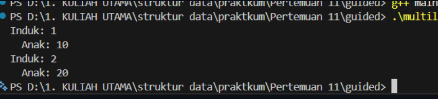
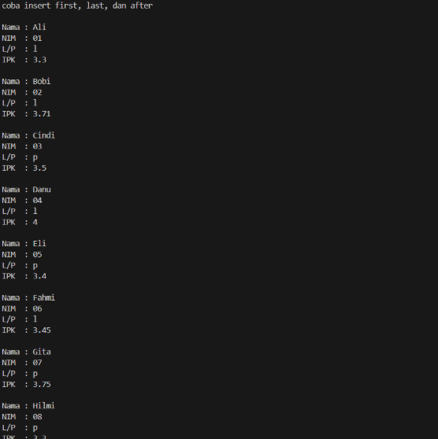

# Laporan Praktikum Struktur Data UTS

## 1. Nama, NIM, Kelas
- **Nama**: Galang Aswangga Saputra
- **NIM**: 103112430053
- **Kelas**: 12-IF-05

## 2. DASAR TEORI
Multi-linked list merupakan salah satu variasi khusus dari struktur data linked list yang memiliki dua atau bahkan lebih urutan kunci logis sekaligus, sehingga setiap elemen dapat dihubungkan melalui beberapa jalur berbeda sesuai kebutuhan pengolahan data. Sebelum mempelajari konsep multi-linked list secara lebih mendalam, terlebih dahulu kita perlu mengingat kembali konsep dasar linked list itu sendiri. Linked list adalah struktur data dinamis yang elemen-elemennya saling terhubung melalui pointer, dan tidak memiliki batasan ukuran tertentu selama memori heap masih mencukupi untuk menyimpan node-node baru. Hingga saat ini, kita telah mengenal beberapa bentuk linked list, seperti Singly Linked List yang hanya memiliki satu arah hubungan, Circular Linked List yang simpul terakhirnya kembali terhubung ke simpul pertama, serta Doubly Linked List yang memungkinkan pergerakan maju dan mundur melalui dua pointer. Pada pembahasan berikutnya, fokus kita akan diarahkan pada multi-linked list, yaitu pengembangan dari konsep-konsep tersebut dengan jumlah hubungan logis yang lebih dari satu.
## 3. GUIDED

### 3.1 multilist.h

```cpp
#ifndef MULTILIST_H_INCLUDED
#define MULTILIST_H_INCLUDED
#define Nil NULL

typedef int infotype;
typedef struct elemen_induk *address_induk;
typedef struct elemen_anak *address_anak;

struct elemen_anak {
    infotype info;
    address_anak next, prev;
};

struct list_anak {
    address_anak first, last;
};

struct elemen_induk {
    infotype info;
    list_anak anak;
    address_induk next, prev;
};

struct list_induk {
    address_induk first, last;
};

void createList(list_induk &L);
address_induk alokasi(infotype x);
void insertLastInduk(list_induk &L, address_induk P);
address_induk findInduk(list_induk L, infotype x);
void insertLastAnak(list_anak &LA, address_anak PA);
address_anak alokasiAnak(infotype x);
void printInfo(list_induk L);

#endif
```
penjelasan
File multilist.h berperan sebagai komponen dasar yang menjadi landasan utama dalam program, karena di dalamnya didefinisikan berbagai tipe data dan struktur yang akan digunakan selama proses pengolahan multilist. Pada file ini, dideklarasikan node untuk elemen induk dan node untuk elemen anak, yang masing-masing dirancang menggunakan struktur doubly linked list, lengkap dengan pointer next dan prev agar setiap elemen dapat saling terhubung dua arah. Selain itu, file ini juga menetapkan struktur list induk dan list anak yang menyimpan pointer first dan last, sehingga proses penyisipan, penghapusan, maupun penelusuran data dapat dilakukan dengan lebih terstruktur.
output
### 3.2 Multilist.cpp

``` cpp
#include "multilist.h"
#include <iostream>
using namespace std;

void createList(list_induk &L) {
    L.first = Nil;
    L.last = Nil;
}

address_induk alokasi(infotype x) {
    address_induk P = new elemen_induk;
    P->info = x;
    P->next = Nil;
    P->prev = Nil;
    P->anak.first = Nil;
    P->anak.last = Nil;
    return P;
}

void insertLastInduk(list_induk &L, address_induk P) {
    if (L.first == Nil) {
        L.first = P;
        L.last = P;
    } else {
        L.last->next = P;
        P->prev = L.last;
        L.last = P;
    }
}

address_induk findInduk(list_induk L, infotype x) {
    address_induk P = L.first;
    while (P != Nil) {
        if (P->info == x) return P;
        P = P->next;
    }
    return Nil;
}
```
penjelasan
File multilist.cpp merupakan tempat implementasi fungsi-fungsi utama yang mengelola list induk pada struktur multilist. Di dalamnya terdapat fungsi createList untuk menginisialisasi list induk agar berada dalam keadaan kosong, serta fungsi alokasi yang membuat node induk baru sekaligus menyiapkan struktur list anak di dalamnya. Proses penambahan node induk ke bagian akhir list ditangani oleh insertLastInduk menggunakan mekanisme doubly linked list, sehingga hubungan antar elemen dapat berlangsung dua arah. Selain itu, fungsi findInduk digunakan untuk mencari node induk berdasarkan nilai tertentu yang ingin diakses. Secara keseluruhan, file ini berperan penting dalam pengaturan relasi tingkat pertama pada multilist, yaitu pengelolaan dan keterkaitan antar node induk.

### 3.3 Multilist_anak.cpp

``` cpp
#include "multilist.h"
#include <iostream>
using namespace std;

address_anak alokasiAnak(infotype x) {
    address_anak P = new elemen_anak;
    P->info = x;
    P->next = Nil;
    P->prev = Nil;
    return P;
}

void insertLastAnak(list_anak &LA, address_anak PA) {
    if (LA.first == Nil) {
        LA.first = PA;
        LA.last = PA;
    } else {
        LA.last->next = PA;
        PA->prev = LA.last;
        LA.last = PA;
    }
}

void printInfo(list_induk L) {
    address_induk PI = L.first;
    while (PI != Nil) {
        cout << "Induk: " << PI->info << endl;
        address_anak PA = PI->anak.first;
        while (PA != Nil) {
            cout << "  Anak: " << PA->info << endl;
            PA = PA->next;
        }
        PI = PI->next;
    }
}

```
penjelasan
File **multilist_anak.cpp** memuat implementasi fungsi-fungsi yang berfokus pada pengelolaan list anak yang terhubung dengan setiap node induk dalam struktur multilist. Di dalamnya terdapat fungsi **alokasiAnak** untuk membuat node anak baru dan **insertLastAnak** untuk menambahkan node anak tersebut ke bagian akhir list anak secara berurutan, tetap mengikuti mekanisme doubly linked list yang memungkinkan hubungan dua arah. Selain fungsi pengelolaan elemen, file ini juga menyediakan prosedur **printInfo**, yang tidak hanya menampilkan data setiap induk, tetapi sekaligus mencetak seluruh node anak yang berkaitan dengan induk tersebut sehingga struktur hierarki data terlihat jelas. Dengan demikian, file ini berperan penting sebagai pengatur hubungan pada tingkat kedua dalam multilist, yaitu pengelolaan kumpulan node anak yang berada di bawah satu node induk.


### 3.4 main.cpp
```cpp
#include "multilist.h"
#include <iostream>
using namespace std;

int main() {
    list_induk L;
    createList(L);

    address_induk P1 = alokasi(1);
    insertLastInduk(L, P1);

    address_anak PA1 = alokasiAnak(10);
    insertLastAnak(P1->anak, PA1);

    address_induk P2 = alokasi(2);
    insertLastInduk(L, P2);

    address_anak PA2 = alokasiAnak(20);
    insertLastAnak(P2->anak, PA2);

    printInfo(L);
    return 0;
}

```

Output

penjelasan
File main.cpp berperan sebagai bagian eksekusi yang menjalankan seluruh fungsi yang telah didefinisikan sebelumnya. Dalam file ini, sebuah list induk dibuat terlebih dahulu, kemudian beberapa induk serta anak ditambahkan ke dalamnya. Setiap induk diberi daftar anak melalui pemanggilan fungsi insert, kemudian seluruh struktur dicetak menggunakan printInfo. File ini menunjukkan bagaimana setiap fungsi bekerja secara terpadu untuk membentuk struktur multilist yang mencerminkan hubungan induk-anak.


## 4. UNGUIDED

### 4.1 circularlist.h
```cpp
#ifndef CIRCULARLIST_H_INCLUDED
#define CIRCULARLIST_H_INCLUDED

#include <iostream>
using namespace std;

#define Nil NULL

// TIPE DATA
typedef struct {
    string nama;
    string nim;
    char jenis_kelamin;
    float ipk;
} infotype;

typedef struct ElmList *address;

struct ElmList {
    infotype info;
    address next;
};

struct List {
    address first;
};

// FUNGSI / PROSEDUR
void createList(List &L);
address alokasi(infotype x);
void dealokasi(address P);

void insertFirst(List &L, address P);
void insertAfter(List &L, address Prec, address P);
void insertLast(List &L, address P);

void deleteFirst(List &L, address &P);
void deleteAfter(List &L, address Prec, address &P);
void deleteLast(List &L, address &P);

address findElm(List L, infotype x);
void printInfo(List L);

#endif
```

penjelasan :
File **circularlist.h** berfungsi sebagai landasan utama dalam pembentukan struktur **circular singly linked list** di dalam program. Pada file ini didefinisikan tipe data **infotype** yang digunakan untuk menyimpan informasi mengenai mahasiswa, serta struktur node **ElmList** yang memuat data tersebut dan sebuah pointer **next** sebagai penghubung ke node berikutnya dalam bentuk lingkaran. Selain itu, disediakan pula struktur **List** yang memiliki pointer **first** sebagai penanda simpul awal list, yang menjadi titik masuk dalam proses penelusuran data. Header ini juga memuat prototipe berbagai operasi penting, mulai dari pembuatan list baru, proses alokasi dan dealokasi node, penyisipan elemen pada berbagai posisi (awal, tengah, maupun akhir), penghapusan elemen, hingga fungsi pencarian untuk menemukan data tertentu. Dengan kumpulan deklarasi tersebut, **circularlist.h** bertindak sebagai blueprint yang mengarahkan bagaimana circular linked list dibentuk, diatur, dan dimanipulasi dalam implementasi program secara keseluruhan.


### 4.2 circularlist.cpp

```cpp
#include "circularlist.h"

void createList(List &L){
    L.first = Nil;
}

address alokasi(infotype x){
    address P = new ElmList;
    P->info = x;
    P->next = Nil;
    return P;
}

void dealokasi(address P){
    delete P;
}

void insertFirst(List &L, address P){
    if(L.first == Nil){
        L.first = P;
        P->next = P;
    } else {
        address Q = L.first;
        while(Q->next != L.first){
            Q = Q->next;
        }
        Q->next = P;
        P->next = L.first;
        L.first = P;
    }
}

void insertAfter(List &L, address Prec, address P){
    if(Prec != Nil){
        P->next = Prec->next;
        Prec->next = P;
    }
}

void insertLast(List &L, address P){
    if(L.first == Nil){
        insertFirst(L, P);
    } else {
        address Q = L.first;
        while(Q->next != L.first){
            Q = Q->next;
        }
        Q->next = P;
        P->next = L.first;
    }
}

void deleteFirst(List &L, address &P){
    P = L.first;

    if(P->next == P){     // 1 elemen
        L.first = Nil;
    } else {
        address Q = L.first;
        while(Q->next != L.first){
            Q = Q->next;
        }
        L.first = P->next;
        Q->next = L.first;
    }
    P->next = Nil;
}

void deleteAfter(List &L, address Prec, address &P){
    P = Prec->next;

    if(P != Nil){
        Prec->next = P->next;
        P->next = Nil;
    }
}

void deleteLast(List &L, address &P){
    if(L.first->next == L.first){   // satu elemen
        deleteFirst(L, P);
    } else {
        address Q = L.first;
        while(Q->next->next != L.first){
            Q = Q->next;
        }
        P = Q->next;
        Q->next = L.first;
        P->next = Nil;
    }
}

address findElm(List L, infotype x){
    if(L.first == Nil) return Nil;

    address P = L.first;
    do{
        if(P->info.nim == x.nim){
            return P;
        }
        P = P->next;
    } while(P != L.first);

    return Nil;
}

void printInfo(List L){
    if(L.first == Nil){
        cout << "List kosong" << endl;
        return;
    }

    address P = L.first;

    do {
        cout << "Nama : " << P->info.nama << endl;
        cout << "NIM  : " << P->info.nim << endl;
        cout << "L/P  : " << P->info.jenis_kelamin << endl;
        cout << "IPK  : " << P->info.ipk << endl;
        cout << endl;
        P = P->next;
    } while(P != L.first);
}

```

penjelasan :
File **circularlist.cpp** berisi implementasi lengkap dari seluruh operasi yang digunakan pada **circular singly linked list**. Di dalamnya, fungsi **createList** bertugas menginisialisasi list agar berada dalam kondisi kosong, sementara fungsi **alokasi** membuat node baru yang memuat data mahasiswa. Berbagai operasi penyisipan—baik di awal list, setelah node tertentu, maupun di bagian akhir—diimplementasikan dengan tetap menjaga sifat sirkular, yaitu node terakhir selalu menunjuk kembali ke node pertama. Proses penghapusan elemen juga dirancang untuk menangani berbagai kemungkinan kondisi list, termasuk kasus ketika hanya terdapat satu elemen saja. Selain itu, fungsi **findElm** digunakan untuk mencari elemen berdasarkan NIM, dan **printInfo** menampilkan seluruh isi list dengan menelusuri node secara melingkar hingga kembali ke awal. Secara keseluruhan, file ini mengimplementasikan seluruh logika utama yang memastikan circular singly linked list bekerja secara konsisten sesuai dengan rancangan struktur datanya.

### 4.3 main.cpp
```cpp
#include <iostream>
#include "circularlist.h"
using namespace std;

address createData(string nama, string nim, char jenis_kelamin, float ipk)
{
    infotype x;
    address P;

    x.nama = nama;
    x.nim = nim;
    x.jenis_kelamin = jenis_kelamin;
    x.ipk = ipk;

    P = alokasi(x);
    return P;
}

int main(){
    List L;
    address P1, P2;
    infotype x;

    createList(L);

    cout << "coba insert first, last, dan after" << endl << endl;

    // dasar: tambah beberapa elemen dengan insertFirst / insertLast
    P1 = createData("Danu", "04", 'l', 4.0);
    insertFirst(L, P1);

    P1 = createData("Fahmi", "06", 'l', 3.45);
    insertLast(L, P1);

    P1 = createData("Bobi", "02", 'l', 3.71);
    insertFirst(L, P1);

    P1 = createData("Ali", "01", 'l', 3.3);
    insertFirst(L, P1);

    P1 = createData("Gita", "07", 'p', 3.75);
    insertLast(L, P1);

    // 1) masukkan Cindi (03) setelah NIM "02" (Bobi)
    x.nim = "02";
    P1 = findElm(L, x);            // cari Bobi
    P2 = createData("Cindi", "03", 'p', 3.5);
    insertAfter(L, P1, P2);

    // 2) masukkan Hilmi (08) setelah NIM "07" (Gita)  -> jadi berada di akhir sesuai gambar
    x.nim = "07";
    P1 = findElm(L, x);            // cari Gita
    P2 = createData("Hilmi", "08", 'p', 3.3);
    insertAfter(L, P1, P2);

    // 3) masukkan Eli (05) setelah NIM "04" (Danu)
    x.nim = "04";
    P1 = findElm(L, x);            // cari Danu
    P2 = createData("Eli", "05", 'p', 3.4);
    insertAfter(L, P1, P2);

    printInfo(L);
    return 0;
}

```

penjelasan :
File main.cpp berperan sebagai bagian eksekusi utama program yang menghubungkan serta memanfaatkan seluruh fungsi yang telah dideklarasikan dalam circularlist.h. Pada file ini, struktur list terlebih dahulu diinisialisasi hingga berada dalam kondisi siap digunakan, kemudian beberapa data mahasiswa dibuat melalui pemanggilan fungsi createData dan dimasukkan ke dalam list. Penyusunan elemen di dalam circular linked list dilakukan dengan memanfaatkan kombinasi berbagai operasi, seperti insertFirst, insertLast, dan insertAfter, termasuk pula proses penyisipan elemen yang posisinya ditentukan berdasarkan node tertentu yang ditemukan melalui findElm. Setelah susunan list terbentuk sesuai alur yang direncanakan, fungsi printInfo digunakan untuk menampilkan seluruh isi circular singly linked list secara utuh. Dengan demikian, file ini menggambarkan bagaimana setiap operasi yang ada pada circular linked list diterapkan secara terstruktur dalam konteks program yang berjalan.

output



## 5. KESIMPULAN

Circular linked list pada program ini memperlihatkan bagaimana suatu struktur data dapat dikelola secara efektif melalui susunan elemen yang saling terhubung membentuk lingkaran, sehingga proses akses dan penelusuran data menjadi lebih fleksibel. Pembagian tugas ke dalam beberapa file membuat alur kerja program menjadi lebih rapi dan sistematis: circularlist.h bertanggung jawab mendefinisikan tipe data serta prototipe fungsi, circularlist.cpp mengimplementasikan seluruh algoritma manipulasi list, sementara main.cpp menjalankan dan menguji operasi-operasi tersebut dalam skenario penggunaan nyata. Seluruh operasi utama—mulai dari penyisipan, penghapusan, pencarian elemen, hingga penelusuran list—dirancang agar tetap mempertahankan sifat sirkular, sehingga node-node dapat diakses secara berkesinambungan tanpa adanya batas awal maupun akhir yang tegas. Secara keseluruhan, implementasi ini menegaskan bahwa circular linked list menawarkan fleksibilitas tinggi dan kestabilan struktur, terutama ketika digunakan untuk mengelola data yang bersifat dinamis dan terus berubah.

## 6. Referensi
1. untuk referensi kali ini saya mengutip dari [https://www.w3schools.com/cpp/default.asp](https://www.w3schools.com/cpp/default.asp)
 