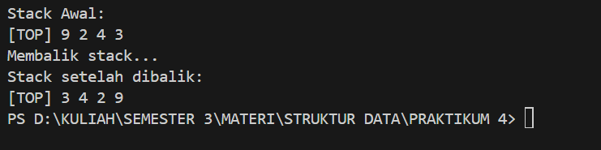
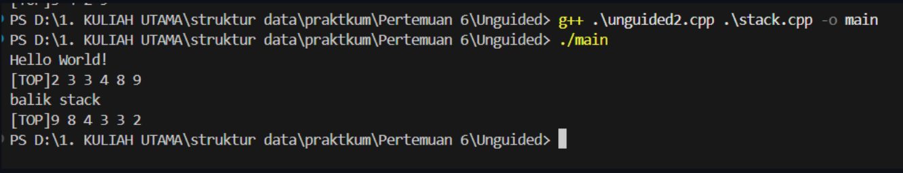

# Laporan Praktikum Struktur Data

## 1. Nama, NIM, Kelas
- **Nama**: Galang Aswangga Saputra
- **NIM**: 103112430053
- **Kelas**: 12-IF-05

## 2. Motivasi Belajar Struktur Data
tentunya selain karena agar lulus matkul ini agar bisa mengambil matkul selanjutnya, belajar struktur data itu penting karena di dalamnya mempelajari bahasa pemrograman c++ yang dimana bahsa ini mau ga mau anak if harus paham, karena banyak liat di dunia sosmed, orang orang tuh bisa menggunkan bahasa ini, jadi ya iri aja gitu, mana semester sebelumnya cuman bahas go
## 3. Dasar Teori
Secara sederhana, stack adalah **struktur data linier** yang digunakan untuk menyimpan sekumpulan objek atau variabel. Setiap penambahan data (push) dan penghapusan data (pop) terjadi di _ujung atas_ tumpukan. Sifat khas stack adalah **LIFO (Last In, First Out)**: data terakhir yang masuk akan menjadi data pertama yang keluar.

Karakteristik utama stack adalah aturan LIFO. Berikut operasi dasar yang biasa diterapkan pada stack:

- **Push:** Menambahkan elemen baru ke _bagian atas_ stack. Misalnya, menumpuk buku baru di atas tumpukan.
- **Pop:** Menghapus elemen di _puncak_ stack dan mengembalikan nilainya. Artinya, buku yang paling atas diambil keluar.
- **Peek/Top:** Melihat (mengintip) elemen teratas tanpa menghapusnya. Seperti mengintip buku paling atas tanpa mengambilnya.
- **IsEmpty:** Memeriksa apakah stack kosong atau tidak. Cocok seperti mengecek apakah masih ada piring di tumpukan.
- **Size:** Mengembalikan jumlah elemen dalam stack. Berguna untuk mengetahui seberapa tinggi tumpukan saat ini.
## 4. Guided
### Guided 1


```cpp
#ifndef STACK_H
#define STACK_H 

#include <iostream>
#define MaxEl 20
#define Nil -1

typedef int infotype;

struct Stack {
    infotype info[MaxEl];
    int top;
};

void CreateStack(Stack &S) ;
bool isEmpty(Stack S) ;
bool isFull(Stack S) ;
void push(Stack &S, infotype X) ;
infotype pop(Stack &S) ;
void printInfo(Stack S) ;
void balikStack(Stack &S) ;

#endif

```

penjelasan:
File **stack.h** berfungsi sebagai header yang mendefinisikan struktur dan fungsi untuk mengelola stack. Di dalamnya terdapat deklarasi tipe data **Stack** dengan array berisi maksimal 20 elemen dan variabel **top**. File ini juga mendeklarasikan fungsi seperti **CreateStack**, **isEmpty**, **isFull**, **push**, **pop**, **printInfo**, dan **balikStack**, sehingga struktur dan implementasi program dapat dipisahkan agar lebih teratur dan mudah dikelola.


### Guided 2

```cpp
#include "stack.h"

using namespace std;

//fungsi membuat stack baru udengan menginisialisasi top = Nil
void CreateStack(Stack &S) {
    S.top = Nil;
}

//fungsi untuk mengecek apakah stack kosong
bool isEmpty(Stack S) {
    return S.top == Nil;
}

//fungsi untuk mengecek apakah stack penuh
bool isFull(Stack S) {
    return S.top == MaxEl - 1;
}

//fungsi untuk menambahkan elemen ke stack
void push(Stack &S, infotype x) {
    if (! isFull(S)) {
        S.top++;
        S.info[S.top] = x;
    } else {
        cout << "stack penuh!" << endl;
    }
}

// fungsi untuk mengambil elemen teratas dari stack (pop)
infotype pop (Stack &S) {
    infotype X = -999;
    if (!isEmpty(S)) {
        X = S.info[S.top];
        S.top--;
    } else {
        cout << "Stack Kosong!" << endl;
    }
    return X;
}

// fungsi untuk menampilkan isi stack
void printInfo(Stack S) {
    if (isEmpty(S)){
        cout << "Stack kosong" << endl;
    } else {
        cout << "[TOP]" ;
        for (int i = S.top; i >= 0; i--) {
            cout << S.info[i] << " ";
        }
        cout << endl;
    }
}

//fungsi untuk membalikan urutan elemen dalam stack
void balikStack(Stack &S) {
    if (!isEmpty(S)) {
        Stack temp1, temp2;
        CreateStack(temp1); CreateStack(temp2);

        while (!isEmpty(S)) {push (temp1, pop(S));}

        while (!isEmpty(temp1)) {push (temp2, pop(temp1));}

        while (!isEmpty(temp2)) {push (S, pop(temp2));}
    }
}
```

Penjelasan
File **stack.cpp** berisi implementasi dari semua fungsi yang dideklarasikan di header. Di dalamnya terdapat logika untuk membuat stack baru, menambah, menghapus, dan menampilkan elemen. **CreateStack** menginisialisasi stack kosong dengan `top = -1`, **isEmpty** dan **isFull** memeriksa kondisi stack, **push** menambahkan elemen ke atas stack, **pop** menghapus elemen teratas, **printInfo** menampilkan isi stack dari atas ke bawah, dan **balikStack** membalik urutan elemen menggunakan dua stack sementara.

### Guided 3

``` cpp
#include "stack.h"
#include <iostream>

using namespace std ;

int main() {
    Stack S;
    CreateStack(S);

    push(S, 3);
    push(S, 4);
    push(S, 8);
    pop(S);
    push(S, 2);
    push(S, 3);
    pop(S);
    push(S, 9);

    cout << "Stack Awal:" << endl;
    printInfo(S);

    cout << "balik Stack" << endl;
    balikStack(S);

    cout << "stack Setelah dibalik:" << endl;
    printInfo(S);

    return 0;
}


```

Output

Penjelasan
File **main.cpp** berfungsi sebagai bagian utama yang menjalankan logika program. Di dalamnya dibuat stack baru (**S**) dengan **CreateStack**, lalu dilakukan operasi **push** dan **pop** untuk membentuk susunan data tertentu. Isi stack ditampilkan menggunakan **printInfo**, kemudian dibalik dengan **balikStack** dan hasilnya kembali ditampilkan.

Ketiga file (**stack.h**, **stack.cpp**, dan **main.cpp**) jika digabung akan membentuk program lengkap yang mensimulasikan cara kerja **struktur data stack** sesuai prinsip **LIFO (Last In, First Out)**, menampilkan isi sebelum dan sesudah dibalik, serta memperlihatkan bagaimana data dikelola dalam memori secara sederhana namun fungsional.


# 5. Unguided
### Unguided 1
Sebelum masuk ke Unguided ada perubahan pada file stack.h dan stack.cpp stack.h

```cpp
#ifndef STACK_H
#define STACK_H

#include <iostream>
#define MaxEl 20
#define Nil -1

typedef int infotype;

struct Stack{
    infotype info[MaxEl]; //array untuk menyimpan elemen stack
    int top;
};

void CreateStack(Stack &S);
bool isEmpty(Stack S);
bool isFull(Stack S);
void push(Stack &S, infotype x); // Menambahkan elemen ke dalam stack
infotype pop(Stack &S); // Mengambil elemen teratas dari stack
void printInfo(Stack S);
void balikStack(Stack &S); // Membalik urutan elemen dalam stack

// procedure tambahan
void pushAscending(Stack &S, infotype X);
void getInputStream(Stack &S);

#endif```

Output

Penjelasan
Program ini mendemonstrasikan double linked list, di mana elmlist menyimpan data dan dua pointer antar elemen, sedangkan List menampung pointer ke first dan last. Operasi yang digunakan meliputi insertFirst, insertLast, insertAfter, dan insertBefore. Di main(), list dibentuk dengan urutan awal 1, 3, 2, kemudian disisipkan 4 sebelum 2 dan 5 sebelum 1, sehingga urutan akhir menjadi 5, 1, 3, 4, 2. Isi list ditampilkan dari depan dan belakang untuk memastikan setiap node terhubung dengan benar.
## Unguided 2

```cpp
#include <iostream>

using namespace std;

#define Nil NULL

  

typedef int infotype;

typedef struct elmlist *address;

  

struct elmlist {

    infotype info;

    address next;

    address prev;

};

  

struct List {

    address first;

    address last;

};

  

address alokasi(infotype x) {

    address P = new elmlist;

    P->info = x;

    P->next = Nil;

    P->prev = Nil;

    return P;

}

  

void dealokasi(address &P) {

    delete P;

    P = Nil;

}

  

void insertFirst(List &L, address P) {

    P->next = L.first;

    P->prev = Nil;

    if (L.first != Nil)

        L.first->prev = P;

    else

        L.last = P;

    L.first = P;

}

  

void printInfo(List L) {

    address P = L.first;

    while (P != Nil) {

        cout << P->info << " ";

        P = P->next;

    }

    cout << endl;

}

  

void deleteFirst(List &L, address &P) {

    P = L.first; L.first = L.first->next;

    if (L.first != Nil) L.first->prev = Nil; else L.last = Nil;

    P->next = Nil; P->prev = Nil;

}

  

void deleteLast (List &L, address &P) {

    P = L.last; L.last = L.last->prev;

    if (L.last != Nil) L.last->next = Nil; else L.first = Nil;

    P->prev = Nil; P->next = Nil;

}

  

void deleteAfter (List &L, address &P, address R) {

    P = R->next; R->next = P->next;

    if (P->next != Nil) P->next->prev = R; else L.last = R;

    P->prev = Nil; P->next = Nil;

}

  

bool deleteByValue(List &L, infotype x) {

    address P = L.first;

  

    while (P != Nil && P->info != x) {

        P = P->next;

    }

  

    if (P == Nil) {

        cout << "Nilai " << x << " tidak ditemukan" << endl;

        return false;

    }

  

    if (P == L.first) {

        L.first = P->next;

        if (L.first != Nil)

            L.first->prev = Nil;

        else

            L.last = Nil;

    } else if (P == L.last) {

        L.last = P->prev;

        if (L.last != Nil)

            L.last->next = Nil;

        else

            L.first = Nil;

    } else {

        P->prev->next = P->next;

        P->next->prev = P->prev;

    }

  

    cout << "Nilai " << x << " berhasil dihapus" << endl;

    dealokasi(P);

    return true;

}

  

void deleteAll(List &L) {

    address P = L.first;

    int count = 0;

    while (P != Nil) {

        address temp = P;

        P = P->next;

        dealokasi(temp);

        count++;

    }

    L.first = Nil;

    L.last = Nil;

    cout << "Semua elemen (" << count << ") berhasil dihapus" << endl;

}

  

int main() {

    List L;

    L.first = Nil;

    L.last = Nil;

  

    cout << "TASK 1: DELETE OPERATIONS" << endl;

  

    // List awal: 2 3 2 1

    insertFirst(L, alokasi(1));

    insertFirst(L, alokasi(2));

    insertFirst(L, alokasi(3));

    insertFirst(L, alokasi(2));

  

    cout << "List awal: ";

    printInfo(L);

  

    // Delete by value 2

    deleteByValue(L, 2);

    cout << "Setelah deleteByValue(2): ";

    printInfo(L);

  

    // Delete value yang tidak ada

    deleteByValue(L, 5);

    cout << "List tetap: ";

    printInfo(L);

  

    // Tambah data baru

    insertFirst(L, alokasi(5));

    cout << "List setelah tambah data: ";

    printInfo(L);

  

    // Delete semua elemen

    deleteAll(L);

  

    return 0;

}
```
Penjelasan
Ada 2 tambahan procedure yaitu void pushAscending dan void getInputStream
stack.cpp

```cpp
#include "stack.h" // mengimpor header file stack.h yang berisi definisi struktur dan konstanta

using namespace std;


void CreateStack(Stack &S){
    S.top = Nil;
}

// FUngsi untuk mengecek apakah stack kosong
bool isEmpty(Stack S){
    return S.top == Nil; // mengembalikan true jika top bernilai Nil, false jika tidak
}

// Fungsi untuk mengecek apakah stack penuh
bool isFull(Stack S){
    return S.top == MaxEl - 1;
}


void push(Stack &S, infotype x){
    if (!isFull(S)){
        S.top++;
        S.info[S.top] = x;
    }else{
        cout << "Stack Penuh!" << endl;
    }
}

// Fungsi untuk mengambil elemen teratas daristack (pop)
infotype pop(Stack &S){
    infotype x = -999;
    if (!isEmpty(S)){
        x = S.info[S.top];
        S.top--;
    } else{
        cout << "Stack Kosong!" << endl;
    }
    return x;
}

// FUngsi untuk menampilkan isi stack
void printInfo(Stack S) {
    if (isEmpty(S)) {
        cout << "Stack Kosong" << endl;
    } else {
        cout << "[TOP]";
        for (int i = S.top; i >= 0; i--) {
            cout << S.info[i] << " ";
        }
        cout << endl;
    }
}

// Fungsi untuk membalik urutan elemen dalam stack
void balikStack(Stack &S) {
    if (!isEmpty(S)) { // Cek apakah stack tidak kosong
        Stack temp1, temp2; // Deklarasi dua stack temporary
        CreateStack(temp1); CreateStack(temp2);

        while (!isEmpty(S)) { push(temp1, pop(S)); }

        while (!isEmpty(temp1)) { push(temp2, pop(temp1)); }

        while (!isEmpty(temp2)) { push(S, pop(temp2)); }
    }
}

// Menambahkan elemen secara ascending
void pushAscending(Stack &S, infotype X) {
    if (isFull(S)) {
        cout << "Stack penuh" << endl;
        return;
    }

    Stack temp;
    CreateStack(temp);

    // Pindahkan elemen yang lebih kecil dari X ke stack sementara
    while (!isEmpty(S) && S.info[S.top] < X) {
        push(temp, pop(S));
    }

    // Push X ke stack utama
    push(S, X);

    // Kembalikan elemen dari stack sementara ke stack utama
    while (!isEmpty(temp)) {
        push(S, pop(temp));
    }
}

// Membaca input stream dari user dan masukkan ke stack
void getInputStream(Stack &S) {
    cout << "Masukkan angka: ";
    string input;
    cin >> input; // membaca seluruh string angka tanpa spasi (misal: 4729601)

    for (char c : input) {
        if (isdigit(c)) { // hanya karakter angka yang valid
            int value = c - '0';
            push(S, value);
        }
    }
}
```
Ada 2 tambahan procedure yaitu void pushAscending dan void getInputStream
### Unguided 1
``` cpp
#include "stack.h"
#include <iostream>
using namespace std;

int main() {
    cout << "Hello World!" << endl;
    Stack S;
    CreateStack(S);

    // Operasi stack
    push(S, 3);
    push(S, 4);
    push(S, 8);
    pop(S);
    push(S, 2);
    push(S, 3);
    pop(S);
    push(S, 9);

    cout << "Stack sebelum dibalik:" << endl;
    printInfo(S);

    balikStack(S);

    cout << "Stack sesudah dibalik:" << endl;
    printInfo(S);

    return 0;
}
```


Output

Penjelasan
program ini cuma nambahin ouput hello word

## Unguided 2
```cpp
#include "stack.h"
#include <iostream>
using namespace std;

int main() {
    cout << "Hello World!" << endl;
    Stack S;
    CreateStack(S);
    pushAscending(S, 3);
    pushAscending(S, 4);
    pushAscending(S, 8);
    pushAscending(S, 2);
    pushAscending(S, 3);
    pushAscending(S, 9);
    printInfo(S);
    cout << "balik stack" << endl;
    balikStack(S);
    printInfo(S);
    return 0;
}

```

Output

Penjelasan
Program **Unguided2.cpp** menguji dua operasi stack, yaitu **pushAscending** untuk menambahkan data secara terurut dan **balikStack** untuk membalik urutan elemen. Setelah membuat stack **S** dan mengisinya dengan beberapa nilai, program menampilkan isi stack sebelum dan sesudah dibalik, sehingga memperlihatkan cara stack mengatur dan memanipulasi data secara terstruktur.

## Unguided 3
```cpp
#include "stack.h"
#include <iostream>
using namespace std;

int main() {
    cout << "Hello world!" << endl;
    Stack S;
    CreateStack(S);

    // gunakan fungsi getInputStream untuk membaca input angka dari user
    getInputStream(S);

    // tampilkan isi stack hasil input
    printInfo(S);

    cout << "balik stack" << endl;
    balikStack(S);

    // tampilkan hasil setelah dibalik
    printInfo(S);

    return 0;
}

```
Output

Penjelasan
Program ini memperlihatkan cara kerja **struktur data stack** yang didefinisikan dalam **stack.h** dan **stack.cpp**. Program membuat stack **S**, menginisialisasinya dengan **CreateStack(S)**, lalu membaca input angka melalui **getInputStream(S)** dan menyimpannya sesuai prinsip **LIFO**. Isi stack ditampilkan menggunakan **printInfo(S)**, kemudian dibalik dengan **balikStack(S)** dan hasilnya kembali ditampilkan untuk menunjukkan perubahan urutan elemen.


## 6. Kesimpulan
Tujuan utama percobaan ini adalah memahami **konsep dasar dan fleksibilitas struktur data Stack** yang bekerja dengan prinsip **LIFO (Last In, First Out)**. Melalui fungsi **push**, **pop**, **printInfo**, dan **balikStack**, terlihat proses penambahan, penghapusan, penampilan, dan pembalikan data dalam stack. Penambahan fungsi **pushAscending** dan **getInputStream** menunjukkan bahwa stack dapat dikembangkan menjadi lebih adaptif. Secara keseluruhan, kegiatan ini menekankan penerapan konsep LIFO serta pengembangannya dalam logika dan perancangan algoritma pemrograman modern.

## 7. Referensi
1. [https://dte.telkomuniversity.ac.id/struktur-data-dasar-array-linked-list-stack-dan-queue/](https://dte.telkomuniversity.ac.id/struktur-data-dasar-array-linked-list-stack-dan-queue/)
 