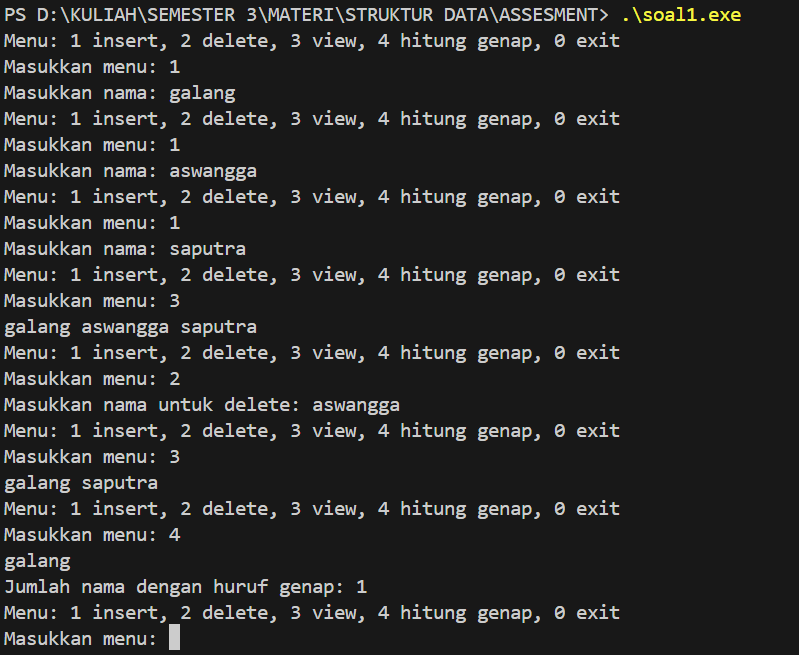
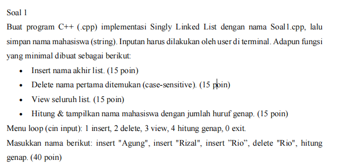
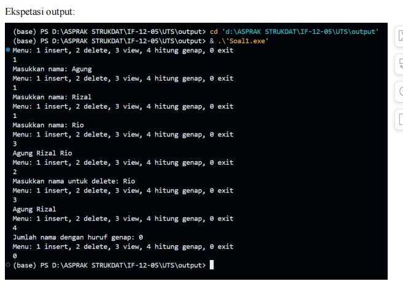

# Laporan Praktikum Struktur Data UTS

## 1. Nama, NIM, Kelas
- **Nama**: Galang Aswangga Saputra
- **NIM**: 103112430053
- **Kelas**: 12-IF-05
- Soal: 1

## 2. CODE

```cpp
#include <iostream>

#include <string>

using namespace std;

  

struct Node {

    string nama;

    Node* next;

};

  

Node* head = nullptr;

  

// fungsi insert nama untuk di akhir list

void insertNama(string nama) {

    Node* newNode = new Node;

    newNode->nama = nama;

    newNode->next = nullptr;

  

    if (head == nullptr) {

        head = newNode;

    } else {

        Node* temp = head;

        while (temp->next != nullptr) {

            temp = temp->next;

        }

        temp->next = newNode;

    }

}

  

// fungsi delete nama pertama yang ditemukan

void deleteNama(string nama) {

    if (head == nullptr) return;

  

    if (head->nama == nama) {

        Node* temp = head;

        head = head->next;

        delete temp;

        return;

    }

  

    Node* current = head;

    while (current->next != nullptr && current->next->nama != nama) {

        current = current->next;

    }

  

    if (current->next != nullptr && current->next->nama == nama) {

        Node* temp = current->next;

        current->next = current->next->next;

        delete temp;

    }

}

  

// fungsi view seluruh list

void viewList() {

    Node* temp = head;

    while (temp != nullptr) {

        cout << temp->nama << " ";

        temp = temp->next;

    }

    cout << endl;

}

  

// fungsi hitung dan tampilkan nama dengan jumlah huruf genap

int hitungGenap() {

    int count = 0;

    Node* temp = head;

    while (temp != nullptr) {

        if (temp->nama.length() % 2 == 0) {

            cout << temp->nama << " ";

            count++;

        }

        temp = temp->next;

    }

    cout << endl;

    return count;

}

  

int main() {

    int menu;

    string nama;

  

    do {

        cout << "Menu: 1 insert, 2 delete, 3 view, 4 hitung genap, 0 exit" << endl;

        cout << "Masukkan menu: ";

        cin >> menu;

        cin.ignore(); // membersihkan buffer

  

        switch(menu) {

            case 1:

                cout << "Masukkan nama: ";

                getline(cin, nama);

                insertNama(nama);

                break;

            case 2:

                cout << "Masukkan nama untuk delete: ";

                getline(cin, nama);

                deleteNama(nama);

                break;

            case 3:

                viewList();

                break;

            case 4: {

                int genapCount = hitungGenap();

                cout << "Jumlah nama dengan huruf genap: " << genapCount << endl;

                break;

            }

            case 0:

                cout << "Keluar program." << endl;

                break;

            default:

                cout << "Menu salah, coba lagi." << endl;

        }

    } while (menu != 0);

  

    // bersihkan memori linked list

    while (head != nullptr) {

        Node* temp = head;

        head = head->next;

        delete temp;

    }

  

    return 0;

}
```

## 3. OUTPUT

Output


## 4. PENJELASAN
program ini menggunakan sll atau single linked list, kenapa menggunakan sll? ya selain karena memang tugasnya seperti itu, sll ini cocok untuk data yang berubah rubah.

Karena program ini menggunakan Linked List, dan Linked List membutuhkan struktur node yang menyimpan data (nama), pointer ke node berikutnya.

Di program ini menggunakan Pointer (Node*) Karena Linked List tidak tersimpan di array, tetapi dibangun dengan menghubungkan node satu per satu. Setiap node harus menunjuk node berikutnya Jadi node diperlukan sebagai komponen dasar dari Linked List.

Program ini juga menggunakan new dan delete karena Code ini menggunakan memori dinamis, bukan array statis. jumlah nama tidak diketahui, kapan pun user bisa menambah data, ukuran list berubah-ubah Sehingga perlu new Node untuk membuat node secara dinamis saat user menambahkan nama dan delete untuk menghapus node saat user melakukan delete nama. Jika tidak memakai delete, maka terjadi memory leak.

Menggunakan getline(cin, nama) Karena user bisa memasukkan nama yang lebih dari satu kata, misalnya "Galang Aswangga Sapputra" Kalau memakai cin >> nama, hanya akan mengambil kata pertama

Karena menu memiliki beberapa pilihan.
switch-case lebih efisien dan lebih mudah dibaca daripada banyak if-else.

Menggunakan do...while Karena program menu harus berjalan berulang sampai user memilih 0 (exit) Dengan do-while menu tampil minimal sekali terus mengulang selama kondisi terpenuhi

Di sini memakai fungsi terpisah (insert, delete, view, hitung) Agar program lebih rapi dan modular. Tanpa fungsi terpisah, main() akan sangat panjang dan sulit dibaca.

seperti yang sudah saya beri tanda di code nya untuk line ke 13 atau fungsi pertama yaitu untuk insert nama untuk di akhir list, lalu untuk line yang ke 30 adalah funsi untuk delete nama pertama yang ditemukan setelah itu pada line ke 53 ada fungsi yang bertujuan untuk melihat atau view seluruh list, lalu pada line ke 63 ada fungsi untung menghitung dan menampilkan nama dengan jumlah huruf genap.
## 5. KESIMPULAN

program ini sudah sesuai dengan apa yang ada dalam soal yaitu 




## 7. Referensi
1. untuk referensi kali ini saya mengutip dari sapri (Saya Pribadi)
 