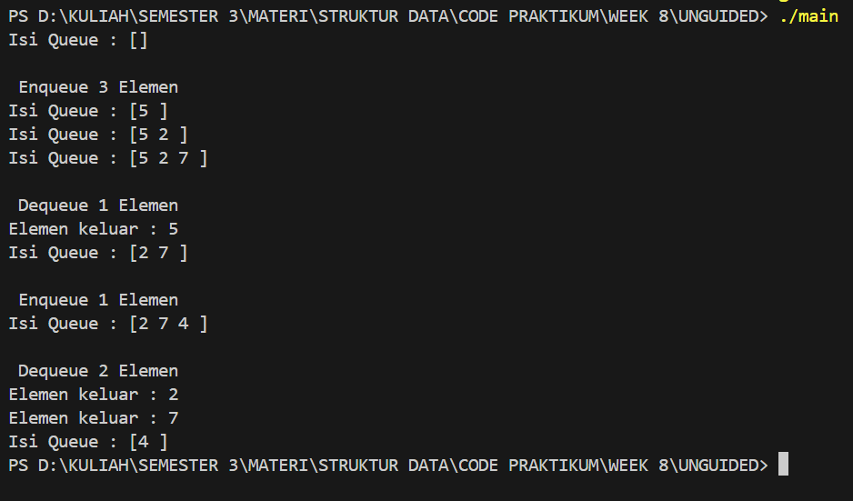
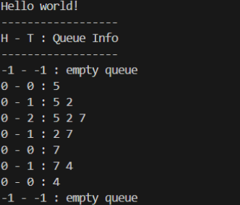
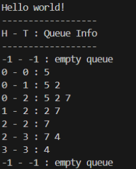
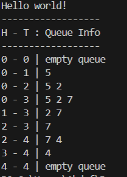

# Laporan Praktikum Struktur Data UTS

## 1. Nama, NIM, Kelas
- **Nama**: Galang Aswangga Saputra
- **NIM**: 103112430053
- **Kelas**: 12-IF-05

## 2. DASAR TEORI
**Struktur data** adalah cara untuk menyimpan, mengatur, dan mengelola data di dalam komputer agar dapat digunakan secara efisien. Struktur data berperan penting dalam pemrosesan informasi dan menjadi dasar dari banyak algoritma. Berikut adalah beberapa teori dasar mengenai struktur data:

- **Array**: Struktur data yang menyimpan elemen dengan tipe data sama dalam urutan tertentu dan diakses menggunakan indeks.
- **Linked List**: Kumpulan simpul (node) yang saling terhubung melalui pointer, di mana setiap simpul berisi data dan alamat simpul berikutnya.
- **Stack**: Struktur data dengan prinsip _Last In First Out (LIFO)_, di mana elemen yang terakhir dimasukkan akan dikeluarkan terlebih dahulu.
- **Queue**: Struktur data dengan prinsip _First In First Out (FIFO)_, di mana elemen yang pertama dimasukkan akan dikeluarkan terlebih dahulu.
- **Graf**: Struktur data yang digunakan untuk menggambarkan hubungan antar objek yang disebut simpul (vertex) dan hubungan antar simpul yang disebut busur (edge).
- **Pohon (Tree)**: Struktur data hierarkis yang terdiri dari simpul dan tepi, dengan satu simpul sebagai akar (root) dan simpul lainnya sebagai anak.

## 3. GUIDED

### 3.1 GUIDED 1

```cpp
#include <iostream>

#include "queue.h"

  

using namespace std;

  
  

int main(){

    Queue Q;

  

    createQueue(Q);

    printInfo(Q);

  

    cout << "\n Enqueue 3 Elemen" << endl;

    enqueue(Q,5);

    printInfo(Q);

    enqueue(Q,2);

    printInfo(Q);

    enqueue(Q,7);

    printInfo(Q);

  

    cout << "\n Dequeue 1 Elemen" << endl;

    cout << "Elemen keluar : " << dequeue(Q) << endl;

    printInfo(Q);

  

    cout << "\n Enqueue 1 Elemen" << endl;

    enqueue(Q,4);

    printInfo(Q);

  

    cout << "\n Dequeue 2 Elemen" << endl;

    cout << "Elemen keluar : " << dequeue(Q) << endl;

    cout << "Elemen keluar : " << dequeue(Q) << endl;

    printInfo(Q);

  

    return 0;

}
```

### 3.2 GUIDED 2

``` cpp
#include "queue.h"

#include <iostream>

  

using namespace std;

  
  

void createQueue(Queue &Q){

    Q.head = 0;

    Q.tail = 0;

    Q.count = 0;

}

  
  

bool isEmpty(Queue Q) {

    return Q.count == 0;

}

  
  

bool isFull(Queue Q) {

    return Q.count == MAX_QUEUE;

}

  
  

void enqueue(Queue &Q, int x) {

    if(!isFull(Q)) {

        Q.info[Q.tail] = x;

  

        Q.tail = (Q.tail + 1) % MAX_QUEUE;

        Q.count++;

    } else {

        cout << "Antrean Penuh!" << endl;

    }

}

  
  

int dequeue(Queue &Q) {

    if(!isEmpty(Q)) {

        int x = Q.info[Q.head];

        Q.head = (Q.head + 1) % MAX_QUEUE;

        Q.count--;

        return x;

    } else {

        cout << "Antrean Kosong!" << endl;

        return -1;

    }

}

  
  

void printInfo(Queue Q) {

    cout << "Isi Queue : [";

    if(!isEmpty(Q)) {

        int i = Q.head;

        int n = 0;

        while (n < Q.count) {

            cout << Q.info[i] << " ";

            i = (i + 1) % MAX_QUEUE;

            n++;

        }

    }

    cout << "]" << endl;

}
```
### 3.3 GUIDED 

``` cpp
#ifndef QUEUE_H

#define QUEUE_H

  

#define MAX_QUEUE 5

  

struct Queue {

    int info [MAX_QUEUE];

    int head;

    int tail;

    int count;

};

  

void createQueue(Queue &Q);

  

bool isEmpty(Queue Q);

  

bool isFull(Queue Q);

  

void enqueue(Queue &Q, int x);

  

int dequeue(Queue &Q);

  

void printInfo(Queue Q);

  

#endif

```

### 3.4 OUTPUT

Output


### 3.5 PENJELASAN
Program di atas adalah bagian `main` yang dipakai untuk mencoba cara kerja **queue** yang sudah dibuat sebelumnya. Pertama, dibuat satu objek `Queue Q`, lalu `createQueue(Q)` dipanggil untuk mengosongkan atau mereset antriannya. Setelah itu, program mulai memasukkan beberapa data ke dalam queue. Pada bagian “Enqueue 3 Elemen”, angka 5, 2, dan 7 dimasukkan satu per satu, dan setiap kali ada elemen baru, `printInfo` dipanggil untuk melihat isi antriannya.

## 4. UNGUIDED

### 4.1 UNGUIDED 1
```cpp
#include "queue.h"

  

void createQueue(Queue &Q) {

    Q.head = -1;

    Q.tail = -1;

}

  

bool isEmptyQueue(Queue Q) {

    return Q.tail == -1;

}

  

bool isFullQueue(Queue Q) {

    return Q.tail == MAX_QUEUE - 1;

}

  

void enqueue(Queue &Q, infotype x) {

    if (isFullQueue(Q)) {

        cout << "Antrean Penuh!" << endl;

    } else {

        if (isEmptyQueue(Q)) {

            Q.head = 0;

        }

        Q.tail++;

        Q.info[Q.tail] = x;

    }

}

  

infotype dequeue(Queue &Q) {

    if (isEmptyQueue(Q)) {

        cout << "Antrean Kosong!" << endl;

        return -1;

    } else {

        infotype x = Q.info[Q.head];

        for (int i = Q.head; i < Q.tail; i++) {

            Q.info[i] = Q.info[i + 1];

        }

        Q.tail--;

        if (Q.tail == -1) {

            Q.head = -1;    

        }

        return x;

    }

}

  

void printInfo(Queue Q) {

    cout << Q.head << " - " << Q.tail << " : ";

    if (isEmptyQueue(Q)) {

        cout << "empty queue" << endl;

    } else {

        for (int i = Q.head; i <= Q.tail; i++) {

            cout << Q.info[i];

            if (i < Q.tail) {

                cout << " ";

            }

        }

        cout << endl;

    }

}
```

output

penjelasan :
Program ini mengimplementasikan queue sederhana berbasis array (non-circular).
Saat dibuat, head dan tail = -1 menandakan antrean kosong.

isEmptyQueue mengecek antrean kosong dari nilai tail,

isFullQueue mengecek apakah tail sudah mencapai batas maksimum array.

Pada enqueue, program mengecek apakah antrean penuh. Jika tidak dan antrean masih kosong, head diset ke 0, lalu tail dinaikkan dan data dimasukkan.
Pada dequeue, jika antrean tidak kosong, data di posisi head diambil lalu seluruh elemen digeser ke depan. Jika setelah itu antrean kosong, head dikembalikan ke -1.
Fungsi printInfo menampilkan posisi head, tail, dan isi antrean, atau tulisan "empty queue" jika kosong.

### 4.2 UNGUIDED 2

```cpp
#include "queue.h"

  

void createQueue(Queue &Q) {

    Q.head = -1;

    Q.tail = -1;

    Q.count = 0;

}

  

bool isEmptyQueue(Queue Q) {

    return Q.count == 0;

}

  

bool isFullQueue(Queue Q) {

    return Q.count == MAX_QUEUE;

}

  

void enqueue(Queue &Q, infotype x) {

    if (isFullQueue(Q)) {

        cout << "Antrean Penuh!" << endl;

    } else {

        if (isEmptyQueue(Q)) {

            Q.head = 0;

            Q.tail = 0;

        } else {

            Q.tail = (Q.tail + 1) % MAX_QUEUE;

        }

        Q.info[Q.tail] = x;

        Q.count++;

    }

}

  

infotype dequeue(Queue &Q) {

    if (isEmptyQueue(Q)) {

        cout << "Antrean Kosong!" << endl;

        return -1;

    } else {

        infotype x = Q.info[Q.head];

        Q.head = (Q.head + 1) % MAX_QUEUE;

        Q.count--;

        if (Q.count == 0) {

            Q.head = -1;

            Q.tail = -1;

        }

        return x;

    }

}

  

void printInfo(Queue Q) {

    cout << Q.head << " - " << Q.tail << " : ";

    if (isEmptyQueue(Q)) {

        cout << "empty queue" << endl;

    } else {

        int i = Q.head;

        for (int c = 0; c < Q.count; c++) {

            cout << Q.info[i];

            if (c < Q.count - 1) cout << " ";

            i = (i + 1) % MAX_QUEUE;

        }

        cout << endl;

    }

}
```
output


penjelasan :
Waktu queue dibuat lewat createQueue, nilai head, tail, dan count diset dulu ke kondisi awal supaya antreannya benar-benar kosong. Fungsi isEmptyQueue dan isFullQueue cuma ngecek apakah jumlah datanya (count) itu 0 atau sudah sama dengan kapasitas maksimum. Pada bagian enqueue, program ngecek dulu penuh atau nggaknya. Kalau penuh, langsung muncul pesan "Antrean Penuh!". Tapi kalau masih ada ruang, dan antrean masih kosong, head dan tail diset ke 0. Kalau sudah pernah terisi, tail digeser ke index berikutnya pakai (tail + 1) % MAX_QUEUE, jadi kalau sudah sampai ujung, dia balik lagi ke index 0. Nilai baru kemudian dimasukin ke posisi tail dan count dinaikkan. Untuk dequeue, data yang paling depan diambil dari posisi head, lalu head juga digeser ke index berikutnya pakai modulo. Setelah count dikurangi, kalau ternyata antrean jadi kosong lagi, head dan tail direset ke -1. Terakhir, printInfo bakal nampilin posisi head dan tail, lalu nge-print isi antrean satu per satu mulai dari head, sambil nge-loop pakai modulo biar tetap bisa muter kalau index-nya lewat batas array. Intinya, circular queue ini lebih efisien karena nggak perlu geser-geser elemen seperti queue biasa.

### 4.3 UNGUIDED 3
```cpp
#include "queue.h"

  

void createQueue(Queue &Q) {

    Q.head = 0;

    Q.tail = 0;

}

  

bool isEmptyQueue(Queue Q) {

    return Q.head == Q.tail;

}

  

bool isFullQueue(Queue Q) {

    return (Q.tail + 1) % MAX_QUEUE == Q.head;

}

  

void enqueue(Queue &Q, infotype x) {

    if (isFullQueue(Q)) {

        cout << "Antrean Penuh!" << endl;

    } else {

        Q.info[Q.tail] = x;

        Q.tail = (Q.tail + 1) % MAX_QUEUE;

    }

}

  

infotype dequeue(Queue &Q) {

    if (isEmptyQueue(Q)) {

        cout << "Antrean Kosong!" << endl;

        return -1;

    } else {

        infotype x = Q.info[Q.head];

        Q.head = (Q.head + 1) % MAX_QUEUE;

        return x;

    }

}

  

void printInfo(Queue Q) {

    cout << Q.head << " - " << Q.tail << " | ";

    if (isEmptyQueue(Q)) {

        cout << "empty queue" << endl;

    } else {

        int i = Q.head;

        while (i != Q.tail) {

            cout << Q.info[i] << " ";

            i = (i + 1) % MAX_QUEUE;

        }

        cout << endl;

    }

}
```
output 

penjelasan :
Saat queue pertama kali dibuat lewat createQueue, nilai head dan tail diset ke 0, yang berarti antreannya masih kosong. Fungsi isEmptyQueue ngecek apakah antrean kosong dengan cara lihat apakah head sama dengan tail, sedangkan isFullQueue ngecek apakah antrean sudah penuh pakai rumus (tail + 1) % MAX_QUEUE == head. Pas enqueue dipanggil, program bakal cek dulu apakah antreannya penuh. Kalau penuh, dia kasih pesan “Antrean Penuh!”. Kalau belum, data baru langsung dimasukin ke posisi tail, terus tail digeser ke index berikutnya pakai modulo biar bisa balik ke 0 kalau sudah sampai akhir array. Pada dequeue, kalau antrean kosong, muncul pesan “Antrean Kosong!”. Tapi kalau masih ada isi, data di posisi head diambil, terus head juga digeser ke index berikutnya dengan cara yang sama. Fungsi printInfo bakal nampilin posisi head dan tail, lalu nge-loop dari head sampai tail sambil nge-print semua isi queue, dan loop-nya juga ikut muter kalau perlu. Intinya, circular queue ini bikin proses antrean jadi efisien karena nggak perlu geser-geser data tiap kali ada yang keluar.

## 5. KESIMPULAN

Praktikum ini membahas konsep dan implementasi ADT Queue dengan tiga mekanisme, yaitu Alternatif 1 (head diam, tail bergerak), Alternatif 2 (head dan tail bergerak), dan Alternatif 3 (circular queue), yang masing-masing memiliki perbedaan dalam cara enqueue dan dequeue serta efisiensi penggunaan memori; Alternatif 1 kurang efisien karena membutuhkan penggeseran elemen saat dequeue, Alternatif 2 lebih baik karena hanya menggeser indeks head namun masih berpotensi mengalami kondisi penuh semu, sedangkan Alternatif 3 merupakan solusi paling optimal karena menggunakan indeks melingkar sehingga tidak memerlukan penggeseran elemen dan tidak mengalami penuh semu, sehingga dapat disimpulkan bahwa pemilihan mekanisme queue sangat berpengaruh terhadap efisiensi program, dengan circular queue sebagai pilihan terbaik untuk antrean berbasis array.

## 6. Referensi
1. untuk referensi kali ini saya mengutip dari [https://www.w3schools.com/cpp/default.asp](https://www.w3schools.com/cpp/default.asp)
 